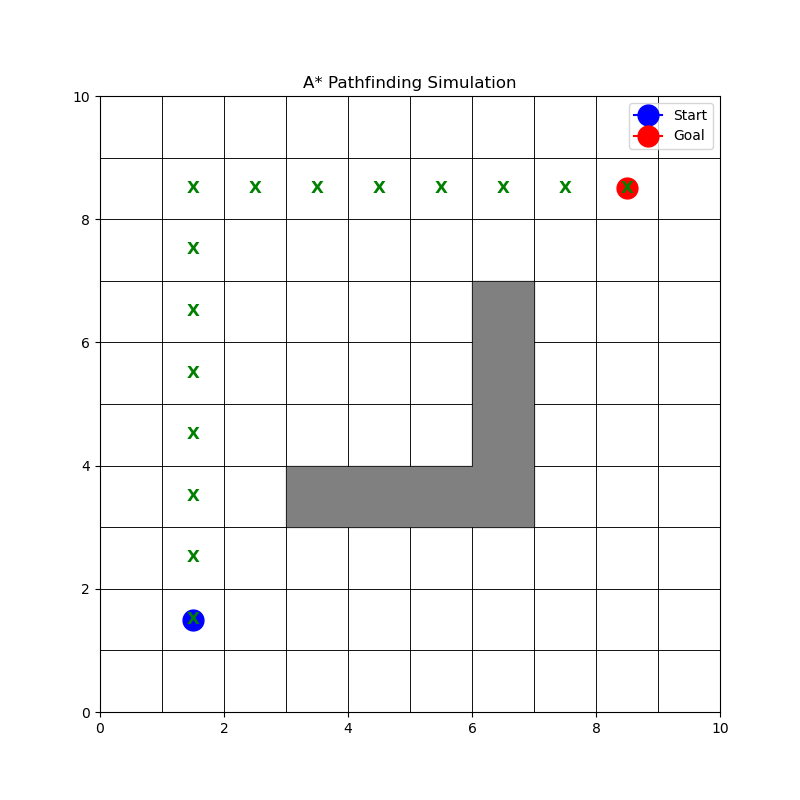

# 🗺️ Intelligent Pathfinding using A* Search Algorithm

A Python implementation of the **A\* (A-Star) Search Algorithm** for intelligent pathfinding on a 2D grid environment — built as part of the **AI Internship at SmartED Innovations** (Dec 2025).



---

## What is A*?

A\* is one of the most widely used pathfinding algorithms in AI and robotics. It finds the **shortest path** between two points by combining:

- **g(n)** — the actual cost from the start node to the current node
- **h(n)** — a heuristic estimate of the cost from the current node to the goal (Manhattan distance here)
- **f(n) = g(n) + h(n)** — the total estimated cost used to prioritize which node to explore next

This makes A\* both **complete** (always finds a path if one exists) and **optimal** (finds the shortest one).

---

## Features

- Custom `Grid` class to define the environment (dimensions, obstacles, start, goal)
- Full A\* implementation using a **min-heap priority queue** (`heapq`)
- **Manhattan distance** heuristic for grid-based movement
- Path reconstruction from goal back to start
- **Matplotlib visualization** — renders the grid, obstacles, optimal path, start and goal points

---

## Tech Stack


- **Language:** Python 3
- **Libraries:** `heapq` (built-in), `matplotlib`
- **Concepts:** Graph Search, Heuristic Functions, Priority Queues, OOP

---

## Project Structure

```
intelligent-pathfinding-astar/
├── main.py            # A* algorithm implementation + visualization
├── Figure_1.png       # Sample output — visualized path
├── Major Project.pdf  # Full project report (SmartED Innovations internship)
└── README.md
```

---

## How to Run

### Prerequisites
- Python 3.x installed
- `matplotlib` library

### Install dependency
```bash
pip install matplotlib
```

### Run the algorithm
```bash
python main.py
```

### Expected output
```
Initializing Grid...
Running A* Search...
Path Found: [(1, 1), (2, 1), (2, 2), (2, 3), (2, 4), ...]
Displaying visualization...
```

A matplotlib window will open showing the 10×10 grid with the optimal path marked in green **X** markers, navigating around the wall obstacles from Start (blue) to Goal (red).

---

## How It Works

```
Grid: 10x10
Start: (1, 1)   →   Goal: (8, 8)

Obstacles (a wall + vertical extension):
  Horizontal: (3,3) (4,3) (5,3) (6,3)
  Vertical:   (6,4) (6,5) (6,6)
```

The algorithm explores nodes using a priority queue ordered by `f(n)`. When it reaches the goal, it reconstructs the path by backtracking through the `came_from` dictionary.

---

## What I Learned

- How A\* balances exploration efficiency with path optimality using heuristics
- Implementing graph search with Python's `heapq` module
- Designing modular OOP code — separating `Grid`, `AStar`, and visualization concerns
- How heuristic choice (Manhattan vs. Euclidean) affects algorithm behaviour on grids

---

## Context

This project was built during my **AI Internship Training at SmartED Innovations** (December 2025) as the major project submission. The full report is included as `Major Project.pdf`.

---

## Author

**M. Adhitya** — B.Tech Computer Engineering, IITRAM Ahmedabad
[](https://www.linkedin.com/in/loveadhitya/)
[](https://github.com/iamadhitya1)
