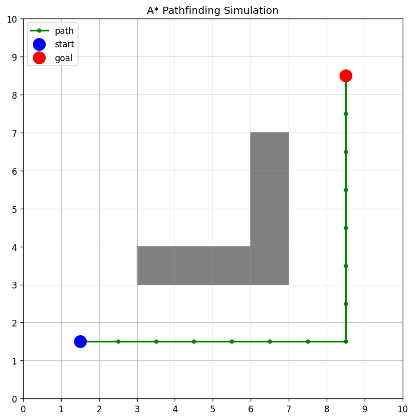

# 🗺️ Intelligent Pathfinding using A* Search Algorithm

A Python implementation of the **A\* (A-Star) Search Algorithm** for intelligent pathfinding on a 2D grid environment — built as part of the **AI Internship at SmartED Innovations** (Dec 2025).



---

## What is A*?

A\* is one of the most widely used pathfinding algorithms in AI and robotics. It finds the **shortest path** between two points by combining:

- **g(n)** — the actual cost from the start node to the current node
- **h(n)** — a heuristic estimate of the cost from the current node to the goal (Manhattan distance here)
- **f(n) = g(n) + h(n)** — the total estimated cost used to prioritize which node to explore next

This makes A\* both **complete** (always finds a path if one exists) and **optimal** (finds the shortest one).

---

## Features

- Custom `Grid` class to define the environment (dimensions, obstacles, start, goal)
- Full A\* implementation using a **min-heap priority queue** (`heapq`)
- **Manhattan distance** heuristic for grid-based movement
- Path reconstruction from goal back to start
- **Matplotlib visualization** — renders the grid, obstacles, optimal path, start and goal points
- **Closed set + lazy deletion** — expanded nodes are never revisited, and stale priority-queue entries are skipped instead of re-processed
- **Sparse `g`/`f` scores** — costs are stored in a dict with an infinity default, not pre-filled for every cell

---

## Tech Stack


- **Language:** Python 3
- **Libraries:** `heapq`, `itertools.count` (built-in), `matplotlib`
- **Concepts:** Graph Search, Heuristic Functions, Priority Queues, OOP

---

## Project Structure

```
intelligent-pathfinding-astar/
├── main.py            # A* algorithm implementation + visualization
├── requirements.txt   # Python dependencies
├── Figure_1.png       # Sample output — visualized path
├── Major Project.pdf  # Full project report
└── README.md
```

---

## How to Run

### Prerequisites
- Python 3.x installed
- `matplotlib` library

### Install dependency
```bash
pip install -r requirements.txt
```

### Run the algorithm
```bash
python main.py
```

### Expected output
```
Running A* search...
Path found (15 steps, cost 14):
[(1, 1), (2, 1), (3, 1), (4, 1), (5, 1), (6, 1), (7, 1), (8, 1), (8, 2), ...]
```

A matplotlib window opens (and `Figure_1.png` is saved) showing the 10×10 grid with the optimal path in green, routing around the wall obstacles from Start (blue) to Goal (red).

---

## How It Works

```
Grid: 10x10
Start: (1, 1)   →   Goal: (8, 8)

Obstacles (a wall + vertical extension):
  Horizontal: (3,3) (4,3) (5,3) (6,3)
  Vertical:   (6,4) (6,5) (6,6)
```

The algorithm explores nodes from a priority queue ordered by `f(n)`. Each node is expanded at most once (tracked in a `closed` set); when a shorter route to a node is found, a fresh queue entry is pushed and the old one is ignored when it surfaces. On reaching the goal the path is rebuilt by backtracking through `came_from`.

Movement is 4-directional at uniform cost, which is what makes the Manhattan heuristic admissible and consistent here. Adding diagonal moves would require an octile/Euclidean heuristic to keep the optimality guarantee.

---

## What I Learned

- How A\* balances exploration efficiency with path optimality using heuristics
- Implementing graph search with Python's `heapq` module
- Designing modular OOP code — separating `Grid`, `AStar`, and visualization concerns
- How heuristic choice (Manhattan vs. Euclidean) affects algorithm behaviour on grids

---

## Context

This project was built during my **AI Internship Training at SmartED Innovations** (December 2025) as the major project submission. The full report is included as `Major Project.pdf`.

---

## Author

**M. Adhitya** — B.Tech Computer Engineering, IITRAM Ahmedabad
[](https://www.linkedin.com/in/loveadhitya/)
[](https://github.com/iamadhitya1)
